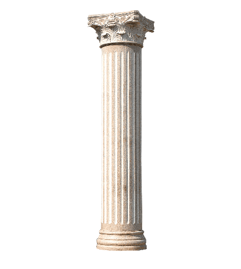
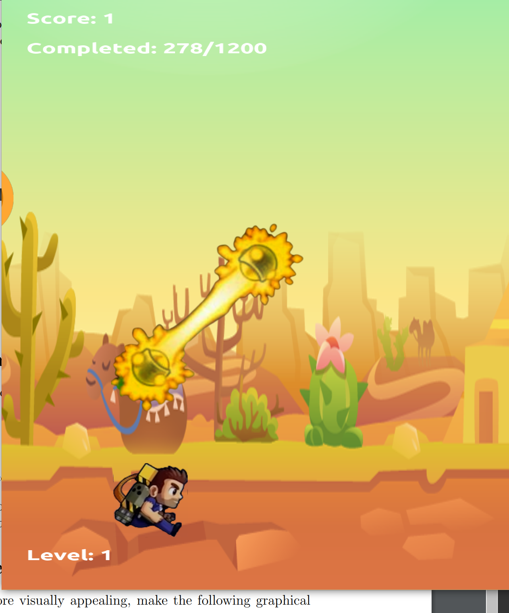

# Propulsion Maniac

---

## Computer Graphics: Spring 2023

> Made by Vineeth Bhat (2021101103)

## Compilation and running:

1. Open Terminal in this folder
2. Run the following commands
    - `mkdir build`
    - `cd build`
    - `cmake .. && make && ./app`

---

## Game Structure

### _Levels_

There are three levels in this game of fixed size (each containing ~15 obstacles each).

The levels are scaled in difficulty by increasing the speed of the game.

Levels are demarcated by pillars.

### _Movement_

The player's movement is constrained along the y-axis. The jetpack is activated by pressing the `spacebar` key and the physics is the same as observed in real life due to gravity.

If the player is on the ground, then the sprite runs (done by looping through textures)

### _Zappers_

Zappers are spawned randomly along the y-axis, and can also be moving vertically.

There are three types of zappers implmented:
1. Vertical (Moves from floor to ceiling with a probability of 0.25)
2. Horizontal
3. Diagonal

### _Coins_

Coins spawn randomly between any two zappers. On collision with the player, the score increments by 1 and the coin disappears.

### _HUD_

We display the following on the screen using the `ft2build.h` library:

1. Level Number
2. Distance Travelled/Distance left in level
3. Number of coins collected

The losing and winning page also display the number of coins collected.

### _Special Effects_

GLSL `smoothstep` has been used to give a radial gradient (glow) to zappers at all times.

Further, the player also glows golden when the jetpack is active.

